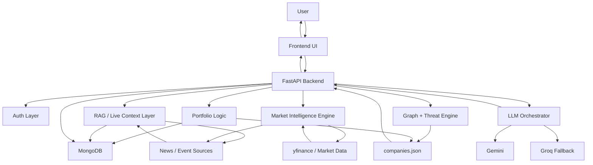
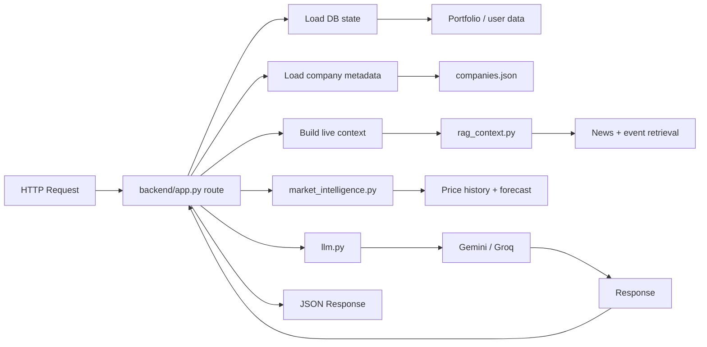
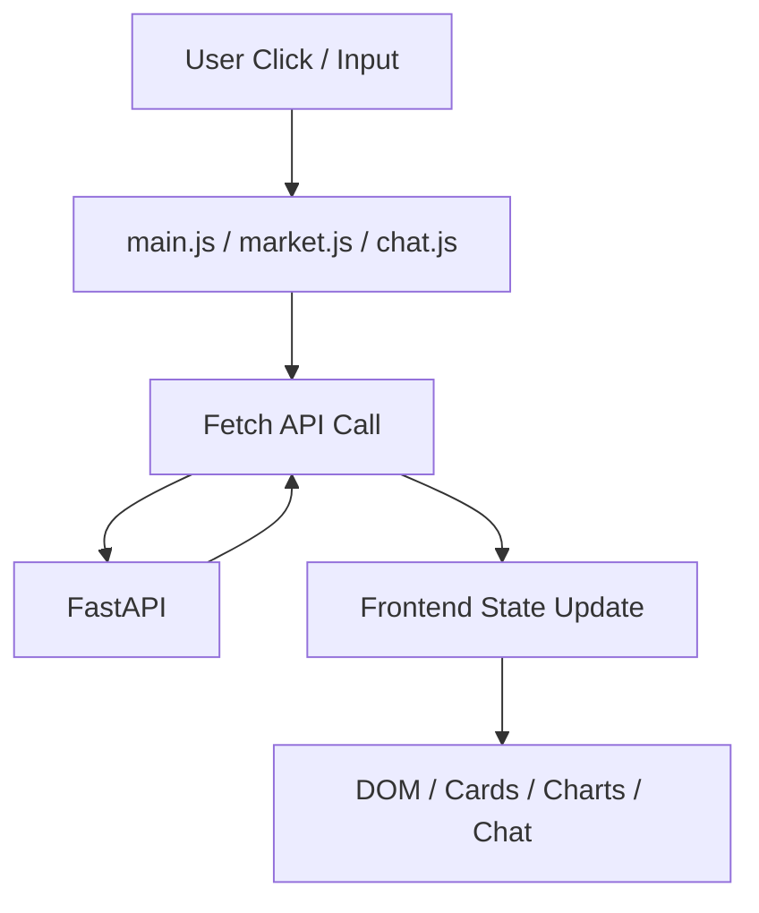

# Artha Sentinel

Artha Sentinel is a strategic market and infrastructure intelligence platform built around one idea: the Indian economy is not just a list of stocks, it is a living network of logistics, energy, finance, defense, policy, and geopolitical dependencies.

The platform combines live market tracking, event-aware AI analysis, strategic company profiling, portfolio intelligence, and a cinematic command-center interface. It is designed to help a user answer questions like:

- What changed in the last few days that affects a company?
- Which holding is my biggest risk right now?
- Should I buy more, hold, trim, or redeploy capital?
- How do war, trade deals, inflation, oil shocks, and defense policy affect Indian strategic companies?

This is not a generic stock dashboard. It is a position-aware intelligence system for strategic Indian equities.

## What The Project Does

Artha Sentinel has five major working layers:

- `Overview`
  - a live operating picture of critical sectors and system threat posture
- `Network Graph`
  - dependency mapping across India's critical listed companies
- `Scenario Engine`
  - attack, disruption, and cascade-style stress simulation
- `Market Intelligence`
  - past and present tracking with company news, macro signals, and event-marked charts
- `Strategic Forecast`
  - a separate future-facing forecast view built on price trend, company significance, event pressure, and historical analogues
- `AI Analyst`
  - a strategic question-answering agent for macro, company, and geopolitical intelligence
- `Personal Advisor`
  - a portfolio-aware copilot that uses holdings, buy prices, risk mode, and live context to advise whether to buy, hold, trim, or avoid

## Why It Exists

Traditional dashboards treat companies as isolated tickers. Artha Sentinel treats them as strategic entities.

Examples:

- Adani Ports is not just a port stock. It sits at the intersection of trade flows, maritime chokepoints, energy logistics, and India’s export capacity.
- ONGC is not just an oil stock. It is an upstream strategic producer whose earnings react differently to crude shocks than downstream refiners like IOC or BPCL.
- HAL is not just a defense stock. Its relevance depends on procurement cycles, execution capacity, indigenous defense priorities, and project-specific developments like AMCA.

That is the core philosophy of the project: price should be interpreted through structure, not only charts.

## Core Features

### 1. Strategic Company Universe

The platform tracks a curated universe of Indian strategic companies across:

- defense
- energy
- finance
- logistics

Each company has a role in the wider national system, such as:

- maritime trade gateways
- crude oil production
- fuel distribution
- private liquidity and banking
- air defense and aerospace manufacturing

### 2. Live Market Intelligence

For each tracked company, the platform can show:

- current price
- long-term historical chart
- date inspector for past prices
- event ribbon with major historical shocks
- company news
- macro signal context

This section is intentionally focused on `past + present`, not future prediction.

### 3. Strategic Forecast Engine

Forecasting is separated from tracking.

The forecast engine combines:

- recent price behavior
- company significance
- live company and sector events
- macro pressure
- historical shock/recovery analogues

This allows the system to think more like:

- is the thesis broken?
- is this temporary fear?
- is this a buy-on-weakness setup?
- is this hold, not add?

instead of blindly extrapolating a chart.

### 4. AI Analyst

The AI Analyst is the strategic research layer. It can answer questions about:

- geopolitics
- supply chains
- company-specific developments
- defense programmes
- macro-economic risk
- strategic dependencies

It now includes live-search-style handling for current factual claims, especially for time-sensitive topics like:

- government approvals
- contracts
- defence programmes
- project participation
- current company developments

### 5. Personal Advisor

The Personal Advisor is where the project becomes position-aware.

It does not only look at a stock. It looks at:

- your buy price
- your quantity
- your unrealized P&L
- your concentration
- your investor mode
- current live context

That means it can distinguish:

- a good company with a bad entry
- a bad company with temporary strength
- a strong winner that should be trimmed
- a conviction holding that should be held, not averaged blindly

It can also express actions more intelligently:

- `BUY MORE`
- `BUY ON WEAKNESS`
- `HOLD`
- `HOLD, DO NOT ADD`
- `TRIM ON STRENGTH`
- `EXIT IF THESIS BROKEN`

## How To Use It

### Step 1: Run the app

```bash
python3 -m uvicorn backend.app:app --host 127.0.0.1 --port 8000 --reload
```

Then open:

```text
http://127.0.0.1:8000
```

### Step 2: Explore the system

Suggested flow:

1. Open `Market Intelligence` and inspect a company’s history and current context.
2. Open `Strategic Forecast` to see the future-facing thesis and projected path.
3. Use `AI Analyst` for company, sector, or geopolitical questions.
4. Add holdings in `Personal Advisor`.
5. Set investor preferences and test the portfolio copilot.

### Step 3: Ask the right kind of questions

Good examples:

- `What changed in the last few days that affects Adani Ports?`
- `As of 4 Feb 2026, has HAL been kicked out of the AMCA programme?`
- `If I bought Adani Ports at 1580 instead of 612, should I hold, add, or reduce?`
- `ONGC is low because of war fear, but if that fear fades or crude stays high, is this a buy-on-weakness case?`
- `Which holding is my biggest risk right now?`

## Setup

### Environment

Create a `.env` file in the project root.

Typical keys used by the project:

```bash
SECRET_KEY=your_secret_key
GEMINI_API_KEY=your_gemini_key
GROQ_API_KEY=your_groq_key
GNEWS_API_KEY=your_gnews_key
ALPHA_VANTAGE_API_KEY=your_alpha_vantage_key
ACLED_EMAIL=your_acled_email
ACLED_PASSWORD=your_acled_password
```

### Installation

```bash
pip install -r requirements.txt
```

### Notes

- Frontend is served directly by FastAPI.
- MongoDB is used for users, portfolios, chat memory, live events, and preferences.
- Live prices and company intelligence are integrated into the same UI.

## Education

This section is intentionally much deeper. It is for learning:

- how the codebase is structured
- how the AI logic works
- what is actually machine learning here
- what is not machine learning
- how live context, memory, and forecasting are stitched together

If you want to understand both the project and the ideas behind it, start here.

### Big Picture: What Kind of System Is This?

Artha Sentinel is a `hybrid intelligence application`.

That means it is not:

- a pure ML project
- a pure data dashboard
- a pure LLM chatbot

It is a system that combines all three.

At a high level, the stack looks like this:

1. `Structured strategic data`
   - company roles
   - criticality
   - dependencies
   - sectors

2. `Live market and event data`
   - yfinance prices
   - news/event feeds
   - macro signals

3. `Heuristic intelligence`
   - portfolio rules
   - strategic significance rules
   - event-impact logic

4. `ML-style analytics`
   - clustering
   - forecast curve generation
   - scenario-based projections

5. `LLM synthesis`
   - Gemini / Groq
   - response writing
   - reasoning across holdings, events, and strategic context

So the project’s real power is not one model. It is the orchestration of:

- data
- rules
- analytics
- language intelligence

### The Most Important Learning Idea

The core lesson of this codebase is:

`good financial intelligence is not only about predicting a number; it is about understanding why that number should move`

That is why the system uses:

- history
- live events
- company significance
- portfolio entry price
- geopolitical structure

instead of blindly saying:

- `price is down, so avoid`
- or
- `price is up, so buy`

### What Is Actually "ML" Here?

This project uses the phrase `ML` in a broad product sense, but technically there are several different layers.

#### 1. Classical ML

The clearest classical ML in the codebase is:

- `KMeans` clustering from `scikit-learn`

This is used in [backend/ml_advanced.py](/Users/vipuljain675/Documents/StrategicShield/backend/ml_advanced.py) to group companies by structural and graph-based features.

Features used include:

- betweenness centrality
- degree centrality
- in-degree
- out-degree
- criticality
- normalized revenue/valuation
- normalized employee count

This is unsupervised learning.

That means:
- there are no labels like `good` or `bad`
- the algorithm just groups similar entities together

This is a useful educational example of:
- feature engineering
- scaling features
- clustering system entities

#### 2. Quantitative Forecasting

The forecasting in [backend/market_intelligence.py](/Users/vipuljain675/Documents/StrategicShield/backend/market_intelligence.py) is not a deep neural network.

It is closer to:

- structured quantitative forecasting
- bounded scenario projection
- event-weighted forecasting

It combines:

- recent price behavior
- drift
- volatility
- sentiment adjustments
- macro adjustments
- structural support
- resilience score

This is a very useful thing to learn:

`not all useful forecasting uses a neural network`

Sometimes a careful hybrid of:

- market math
- event scoring
- domain rules

is more interpretable than a black-box deep model.

#### 3. Heuristic Decision Intelligence

Some of the most important logic in this project is not ML at all.

It is deterministic rule logic in [backend/app.py](/Users/vipuljain675/Documents/StrategicShield/backend/app.py), such as:

- `_entry_quality(...)`
- `_position_state(...)`
- `_thesis_status(...)`
- `_position_advice_context(...)`

This is the layer that allows the app to reason like:

- `good company, bad entry`
- `big winner, trim on strength`
- `thesis intact, buy on weakness`
- `hold, do not add`

This matters educationally because many “AI” systems fail not from weak language models, but from weak decision framing.

#### 4. LLM Reasoning

The final explanation layer is in [backend/llm.py](/Users/vipuljain675/Documents/StrategicShield/backend/llm.py).

This is where the project:

- constructs the system prompt
- calls Gemini first
- falls back to Groq if needed
- now uses live Google Search for time-sensitive claims

This means the LLM is not doing raw prediction from scratch.

It is mainly doing:

- synthesis
- explanation
- recommendation formatting
- multi-factor reasoning over pre-built context

That is exactly how many strong real-world AI apps are built.

### Is There a Neural Network In This Project?

Not in the classic custom-trained sense.

There is no:

- PyTorch model
- TensorFlow training pipeline
- custom LSTM
- transformer training loop

The closest things to “neural” intelligence here are external foundation models:

- Gemini
- Groq-hosted Llama model

Those models are already trained. Your project does not train them. It uses them.

So if you are learning ML, it is important to say this clearly:

`This project is an AI application, but not a deep-learning training project.`

That is perfectly fine. In fact, that is how many modern products are built.

### What Is RAG Here?

The RAG-style layer in this project lives mainly in [backend/rag_context.py](/Users/vipuljain675/Documents/StrategicShield/backend/rag_context.py).

RAG means:

- `Retrieval-Augmented Generation`

In simple terms:

- before asking the model to answer
- the app first retrieves relevant context
- then injects that context into the prompt

In this project, retrieval includes:

- company detection from the user query
- portfolio holding detection
- sector query generation
- macro keyword detection
- news/event fetches
- cached live-event memory
- live market snapshot insertion

So the model does not answer from memory alone.
It answers from:

- retrieved context
- plus model reasoning

That is why this project is educationally interesting:

it shows how RAG can be done without a vector database.

Here, RAG is more like:

- event retrieval
- structured cache retrieval
- query-driven news retrieval

instead of:

- embeddings
- vector similarity search
- chunk retrieval from PDFs

### How The Live Context Layer Works

The live context system in [backend/rag_context.py](/Users/vipuljain675/Documents/StrategicShield/backend/rag_context.py) does several things:

#### Step 1: Detect relevant companies

It parses:

- user message
- portfolio holdings

and matches them against the tracked company universe.

#### Step 2: Build search queries

It creates live queries using:

- company names
- tickers
- sectors
- macro keywords

#### Step 3: Fetch fresh event/news data

It uses:

- NewsAPI
- GDELT
- cached event data

and stores short-term memory in Mongo.

#### Step 4: Build prompt context

It constructs a compact context block describing:

- current price behavior
- current events
- relevant headlines
- macro pressure

This context is then injected into AI prompts in [backend/app.py](/Users/vipuljain675/Documents/StrategicShield/backend/app.py).

### Why The "Live" Layer Matters

One of the most important bugs fixed during development was this:

- the app had live-ish context
- but not live factual verification on every current claim

That is why the HAL / AMCA issue mattered so much.

The solution was to make time-sensitive claims trigger a stronger live search path in [backend/llm.py](/Users/vipuljain675/Documents/StrategicShield/backend/llm.py), instead of relying only on cached assumptions.

Educational lesson:

`live data` and `live verification` are not the same thing

That distinction is central to building trustworthy AI systems.

### Forecasting Philosophy In This Project

The project separates:

- `Market Intelligence`
- from
- `Strategic Forecast`

This is an important design decision.

#### Market Intelligence

This is for:

- current price
- past price
- event ribbon
- company news
- macro signal

This is factual, observational, descriptive.

#### Strategic Forecast

This is for:

- future path
- bullish case
- base case
- risk case
- factor attribution

This is modeled, interpretive, predictive.

Keeping them separate prevents a common product problem:

- mixing facts and model outputs so the user cannot tell which is which

### How The Strategic Forecast Is Built

The strategic forecast lives primarily in [backend/market_intelligence.py](/Users/vipuljain675/Documents/StrategicShield/backend/market_intelligence.py).

Key ideas used there:

#### 1. Price history

The app pulls daily data with `yfinance`.

This gives:

- date series
- close prices
- current price
- all-time high
- all-time low

This is the factual base.

#### 2. Company profile

The app loads company metadata from [backend/data/companies.json](/Users/vipuljain675/Documents/StrategicShield/backend/data/companies.json), including:

- role
- criticality
- employees
- revenue
- description

This gives structural context.

#### 3. Resilience score

The code checks whether a company recovered well after major past shocks.

This allows the model to ask:

- did this company bounce back after a negative event?

That is a very human way to think about strategic equities.

#### 4. Historical analogue

The system tries to find a meaningful event analogue, such as:

- Hindenburg Report
- Covid Crash
- Russia-Ukraine War

Then it checks:

- what happened to the stock over the next 30 sessions?

This is not perfect science, but it is a very useful educational pattern:

`forecast = current setup + historical analogy`

#### 5. News and macro signals

Forecast inputs are adjusted by:

- company news
- macro signal
- structural support
- resilience

This is where the project moves beyond pure chart projection.

### Why This Is Not A Pure Neural Forecast

You specifically wanted the model to think like:

- company significance
- relationship with government
- live news
- current events
- past events

This is actually more powerful for this product than a naive LSTM.

Why?

Because if you train a generic neural network only on price history, it often will not “understand”:

- India-EU trade deal
- Hormuz disruption
- defense contract change
- policy support
- government alignment

So the project uses a hybrid approach:

- data-driven enough to be disciplined
- rule-aware enough to understand strategic structure

Educational lesson:

`Sometimes the best model is not the fanciest model. It is the model that matches the problem.`

### Libraries Used And Why

From [requirements.txt](/Users/vipuljain675/Documents/StrategicShield/requirements.txt):

#### API / Backend

- `fastapi`
  - builds HTTP API routes
- `uvicorn`
  - runs the ASGI server
- `pydantic` via FastAPI
  - validates request/response models

#### Data / Market

- `yfinance`
  - stock price and historical data
- `requests`
  - HTTP requests to news and external data sources
- `pandas`
  - tabular data manipulation
- `numpy`
  - numerical operations, arrays, time-series math

#### ML / Analytics

- `scikit-learn`
  - KMeans clustering
  - scaling / preprocessing
- `networkx`
  - graph structure, dependencies, centrality metrics

#### AI / LLM

- `google-genai`
  - Gemini integration
- `groq`
  - fallback LLM provider

#### Auth / Security

- `passlib[bcrypt]`
  - password hashing
- `python-jose[cryptography]`
  - JWT creation and verification
- `Authlib`
  - Google OAuth
- `itsdangerous`
  - session protection

#### Database

- `pymongo`
  - MongoDB integration

### Codebase Deep Dive

Below is the real mental map of the codebase.

### [backend/app.py](/Users/vipuljain675/Documents/StrategicShield/backend/app.py)

This is the operational center of the backend.

It handles:

- FastAPI app bootstrapping
- middleware
- startup hooks
- auth-protected routes
- portfolio endpoints
- chat endpoints
- preference endpoints
- live event worker startup

This file also contains important decision logic:

- `_portfolio_action_label(...)`
- `_entry_quality(...)`
- `_position_state(...)`
- `_thesis_status(...)`
- `_holding_cases(...)`
- `_position_advice_context(...)`

These functions are some of the most educational parts of the codebase because they show how raw market data becomes actionable investing logic.

### [backend/llm.py](/Users/vipuljain675/Documents/StrategicShield/backend/llm.py)

This is the LLM gateway.

Responsibilities:

- define the system prompt
- call Gemini
- fall back to Groq
- decide when live Google Search should be used
- prevent silent bluffing on current factual claims

This file is useful if you want to learn:

- prompt engineering
- model orchestration
- fallback strategy
- when to let the model search the web

### [backend/rag_context.py](/Users/vipuljain675/Documents/StrategicShield/backend/rag_context.py)

This file is the retrieval engine.

Responsibilities:

- detect companies in user questions
- derive macro keywords
- build relevant search queries
- fetch news and event data
- cache event payloads in Mongo
- build a structured live-context block

If you want to understand “RAG without embeddings,” this is the key file.

### [backend/market_intelligence.py](/Users/vipuljain675/Documents/StrategicShield/backend/market_intelligence.py)

This is where market tracking and strategic forecast data are assembled.

Responsibilities:

- get stock history
- build company profile
- calculate resilience score
- calculate historical analogue
- aggregate company news
- aggregate macro signals
- generate forecast curves
- return the full payload for the market and forecast UIs

This file is one of the best learning files if you want to understand:

- financial data plumbing
- hybrid forecasting
- feature-based interpretation
- the gap between charting and strategy

### [backend/ml_advanced.py](/Users/vipuljain675/Documents/StrategicShield/backend/ml_advanced.py)

This file contains the more explicitly “ML” flavored utilities:

- KMeans clustering
- simulated sector threat forecasting
- scenario generation helpers

This is a good file to study for:

- feature engineering
- unsupervised learning
- practical use of `scikit-learn`
- how analytics and LLM reports can be combined

### [backend/graph_engine.py](/Users/vipuljain675/Documents/StrategicShield/backend/graph_engine.py)

This file powers the dependency graph.

It computes:

- node metrics
- dependency relationships
- shortest path logic
- top critical entities

This is where `networkx` becomes useful.

### [backend/threat_engine.py](/Users/vipuljain675/Documents/StrategicShield/backend/threat_engine.py)

This file summarizes threat posture by sector.

It helps convert company-level structure into:

- sector-level risk understanding
- summary views for the dashboard

### [backend/database.py](/Users/vipuljain675/Documents/StrategicShield/backend/database.py)

This is the persistence layer.

It initializes and manages collections such as:

- users
- portfolios
- chat memory
- live events
- live event cache
- user preferences

Educational lesson:

`AI products become much stronger when memory and state are stored cleanly.`

### Frontend Deep Dive

### [frontend/index.html](/Users/vipuljain675/Documents/StrategicShield/frontend/index.html)

This is the skeleton of the application.

It defines:

- splash screen
- sidebar
- all main views
- market panels
- personal advisor panels
- forecast view containers

### [frontend/js/main.js](/Users/vipuljain675/Documents/StrategicShield/frontend/js/main.js)

This is the frontend control center.

It handles:

- authentication state
- portfolio CRUD
- user preference loading/saving
- personal advisor requests
- screen switching
- status rendering

This file is very helpful for learning how product logic is often coordinated on the client side.

### [frontend/js/market.js](/Users/vipuljain675/Documents/StrategicShield/frontend/js/market.js)

This file powers:

- market charts
- forecast charts
- date inspector
- event ribbon
- company news rendering
- strategic forecast rendering

This is where backend analytics become visible UI.

### [frontend/js/chat.js](/Users/vipuljain675/Documents/StrategicShield/frontend/js/chat.js)

This file powers the AI Analyst chat experience.

It manages:

- message rendering
- thinking/progress states
- live chat UX

### [frontend/js/graph.js](/Users/vipuljain675/Documents/StrategicShield/frontend/js/graph.js)

This handles graph rendering and interaction for the dependency network.

### [frontend/css/style.css](/Users/vipuljain675/Documents/StrategicShield/frontend/css/style.css)

This is the main design layer for:

- splash screen
- app shell
- typography
- layout
- major view styling

### [frontend/css/market.css](/Users/vipuljain675/Documents/StrategicShield/frontend/css/market.css)

This focuses on:

- market intelligence panels
- forecast view layout
- charts and side cards

### [backend/data/companies.json](/Users/vipuljain675/Documents/StrategicShield/backend/data/companies.json)

This file is the domain backbone of the app.

It contains:

- tracked companies
- sectors
- roles
- criticality
- descriptions
- threats
- protections
- dependencies

This is what lets the project reason in strategic rather than generic-stock language.

### How Personal Advisor Actually Thinks

This is one of the most important learning parts.

When you ask a portfolio question, the advisor does not only see:

- ticker
- quantity

It builds a richer intelligence object from:

- buy price
- current price
- P&L
- concentration
- sector
- role
- criticality
- investor preferences
- live event/news context

Then it tries to map that into:

- `buy more`
- `buy on weakness`
- `hold`
- `hold, do not add`
- `trim on strength`
- `exit if thesis broken`

This is a very practical example of `decision intelligence`.

### Why Entry Price Matters So Much

One major product lesson from this project is:

`the same stock can deserve different advice for different users`

Example:

- Adani Ports bought at `₹612`
- Adani Ports bought at `₹1580`

Same company.
Different advice.

Why?

Because:

- one user has a huge cushion
- another has a weak entry
- one can afford patience
- another must avoid blind averaging

This is one of the best conceptual lessons in the codebase.

### What This Project Still Is Not

For clarity:

This project is not:

- a high-frequency trading engine
- a backtested alpha research system
- a true deep-learning training lab
- a guaranteed-price-prediction machine

It is:

- a strategic intelligence application
- a portfolio-aware decision assistant
- a hybrid forecasting and reasoning system

### How To Study This Codebase

Best order:

1. Read [backend/data/companies.json](/Users/vipuljain675/Documents/StrategicShield/backend/data/companies.json)
   - understand the domain model first
2. Read [backend/graph_engine.py](/Users/vipuljain675/Documents/StrategicShield/backend/graph_engine.py)
   - understand structure and dependencies
3. Read [backend/rag_context.py](/Users/vipuljain675/Documents/StrategicShield/backend/rag_context.py)
   - understand live context and retrieval
4. Read [backend/market_intelligence.py](/Users/vipuljain675/Documents/StrategicShield/backend/market_intelligence.py)
   - understand tracking and forecast logic
5. Read [backend/app.py](/Users/vipuljain675/Documents/StrategicShield/backend/app.py)
   - understand product logic and advisor reasoning
6. Read [backend/llm.py](/Users/vipuljain675/Documents/StrategicShield/backend/llm.py)
   - understand prompt and model orchestration
7. Read [frontend/js/main.js](/Users/vipuljain675/Documents/StrategicShield/frontend/js/main.js) and [frontend/js/market.js](/Users/vipuljain675/Documents/StrategicShield/frontend/js/market.js)
   - understand how the backend becomes an experience

### Final Educational Takeaway

Artha Sentinel is a strong example of a modern AI product where:

- domain knowledge matters
- retrieval matters
- state and memory matter
- portfolio logic matters
- ML is only one layer of the system

If you understand this codebase well, you will understand a very important modern engineering truth:

`real AI products are not built from one model alone; they are built from architecture.`

## System Architecture

Below is the simplest way to understand the full product architecture.



In words:

- the user interacts with the frontend
- the frontend calls FastAPI
- FastAPI gathers holdings, preferences, company metadata, news, prices, and event memory
- the backend creates a structured intelligence context
- that context is passed into the LLM
- the LLM writes the final answer
- the frontend renders the result as a product experience

## Request Lifecycle

This section explains what actually happens when a user clicks around or asks something.

### Case 1: User opens Market Intelligence

Flow:

1. frontend sends selected ticker to `/api/market`
2. backend loads company metadata
3. backend fetches price history using `yfinance`
4. backend fetches company news and macro signal
5. backend computes:
   - resilience score
   - historical analogue
   - strategic forecast summary
6. frontend renders:
   - history chart
   - event ribbon
   - news panel
   - macro signal
   - forecast section

What you learn here:

- how to combine structured data and live data
- how to build one API that returns everything the UI needs
- how charting and intelligence can be joined in one payload

### Case 2: User asks AI Analyst a strategic question

Flow:

1. frontend sends message to `/api/chat`
2. backend calls `rag_context.build_context(...)`
3. the retrieval layer:
   - detects companies
   - detects macro keywords
   - builds live queries
   - pulls cached or fresh event data
4. backend creates an augmented prompt
5. backend sends prompt to `llm.chat(...)`
6. Gemini answers, with live search enabled for current-claim questions
7. response is saved to chat memory
8. frontend renders answer

What you learn here:

- how retrieval improves model quality
- how memory is stored
- how LLMs work much better with structured context than with raw user text alone

### Case 3: User asks Personal Advisor about a holding

Flow:

1. frontend sends portfolio question to `/api/personal/chat`
2. backend loads:
   - holdings
   - buy price
   - buy date
   - quantity
   - user preferences
3. backend computes portfolio intelligence:
   - P&L
   - concentration
   - entry quality
   - position state
   - thesis status
   - action context
4. backend adds live event/news context from the retrieval layer
5. backend instructs the LLM to answer in a position-aware format
6. final answer is returned and stored in persistent chat history

What you learn here:

- how decision systems should separate data preparation from language generation
- how portfolio-specific AI should reason differently for the same stock depending on entry price and investor style

## From User Question To AI Answer

This is the most important educational flow in the whole project.

Suppose the user asks:

`If I bought Adani Ports at ₹1580 instead of ₹612, should I hold, add, or reduce?`

The system should not answer that directly from a model’s internal memory.

Instead, the full pipeline is:

### Step 1: Understand the question type

The backend first classifies the request as:

- portfolio question
- existing holding
- action-oriented
- requires entry-price reasoning

### Step 2: Load portfolio reality

The app loads:

- ticker
- quantity
- buy price
- buy date
- live price
- portfolio weight

### Step 3: Compute position features

The code in [backend/app.py](/Users/vipuljain675/Documents/StrategicShield/backend/app.py) derives:

- `entry_quality`
- `position_state`
- `thesis_status`
- `action_context`

This turns raw holdings into interpreted state.

### Step 4: Retrieve live context

The app then gathers:

- company context
- macro context
- event context
- company news

This comes from [backend/rag_context.py](/Users/vipuljain675/Documents/StrategicShield/backend/rag_context.py).

### Step 5: Construct the final prompt

The final prompt contains:

- user preferences
- holding details
- sector role
- current live event context
- specific response rules

### Step 6: Ask the model to synthesize, not invent

Now the LLM is asked to do the last-mile reasoning:

- explain the bull case
- explain the bear case
- choose the best action
- respect user style

### Step 7: Return a formatted answer

The output is then shown in a structured way:

- position status
- bull case
- bear case
- action now

Educational lesson:

`the model should be the final writer, not the only thinker`

That is one of the strongest patterns in modern AI engineering.

## Backend Execution Map

If you want to mentally trace execution, think of it like this:



This is a good pattern to remember:

- route layer
- context layer
- analytics layer
- model layer
- response layer

## Frontend Execution Map

The frontend has a similar learning pattern:



What this teaches:

- the frontend is not “smart” by itself
- it is an orchestration layer
- backend produces intelligence
- frontend turns intelligence into an experience

## Database / Memory Design

MongoDB stores the parts of the system that need memory or persistence.

Typical categories include:

- `users`
  - account identity
- `portfolios`
  - holdings, quantities, buy prices, buy dates
- `chat_memory`
  - saved chat history for analyst and portfolio modes
- `user_preferences`
  - risk mode, conviction style, time horizon, reply style
- `live_events`
  - stored event memory
- `live_event_cache`
  - cached event/news fetches

This is a good educational example of one important rule:

`stateless models become much stronger when the application gives them memory`

## What To Read If You Want To Learn ML From This Project

Use this sequence:

### Beginner path

1. [backend/data/companies.json](/Users/vipuljain675/Documents/StrategicShield/backend/data/companies.json)
2. [backend/graph_engine.py](/Users/vipuljain675/Documents/StrategicShield/backend/graph_engine.py)
3. [backend/app.py](/Users/vipuljain675/Documents/StrategicShield/backend/app.py)

This teaches:

- domain modeling
- graph thinking
- rule-based intelligence

### Intermediate path

4. [backend/ml_advanced.py](/Users/vipuljain675/Documents/StrategicShield/backend/ml_advanced.py)
5. [backend/market_intelligence.py](/Users/vipuljain675/Documents/StrategicShield/backend/market_intelligence.py)

This teaches:

- clustering
- scaling
- feature use
- practical forecasting logic

### Advanced AI product path

6. [backend/rag_context.py](/Users/vipuljain675/Documents/StrategicShield/backend/rag_context.py)
7. [backend/llm.py](/Users/vipuljain675/Documents/StrategicShield/backend/llm.py)

This teaches:

- retrieval
- prompt engineering
- live-search integration
- model orchestration

## What A Student Should Notice

If you are studying this like an edtech case study, focus on these lessons:

### Lesson 1: Data shape matters

If company data is rich, the AI can speak in rich strategic terms.

### Lesson 2: Wrong data destroys good reasoning

If the input data is wrong, even a smart AI can give bad advice.

### Lesson 3: Rules and ML are not enemies

Good products often combine:

- rule logic
- analytics
- retrieval
- LLMs

### Lesson 4: Prediction should be interpretable

A useful forecast is not just:

- `price will be X`

It should say:

- why
- based on what
- what could invalidate it

### Lesson 5: AI products are architecture problems

Most of the difficulty is not calling a model.

It is:

- choosing context
- preparing data
- storing memory
- defining logic
- deciding when the model should search the web

That is what this project teaches very well.

## Suggested Future Improvements

- stronger multi-source live news reliability
- structured event-scoring engine for all 50 companies
- better source ranking and credibility filtering
- clearer confidence and thesis-state visualization
- test suite for position logic and forecast reasoning
- explicit source cards with links in the UI

## Final Note

Artha Sentinel was built to feel like a real strategic operating system, not just another finance demo.

Its strongest idea is simple:

`markets move through structure, conflict, policy, and psychology — not price charts alone.`
